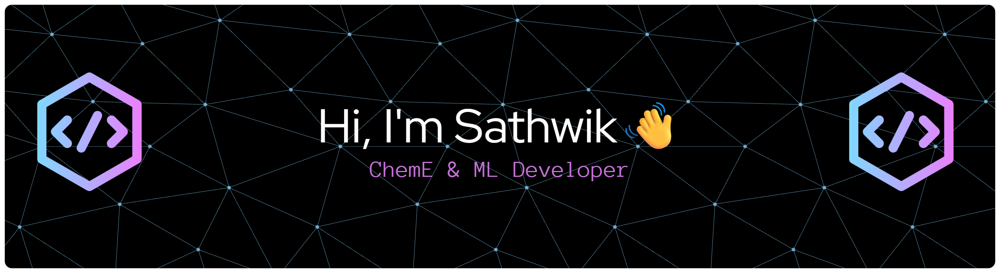

### 🚀 About Me

- 🔭 I'm currently pursuing my Bachelor's in Chemical Engineering with a focus in Business and AI at the University of Toronto.  
- 📝 Passionate about leveraging data-driven insights, I explore the intersection of engineering, technology, and finance through projects in **Machine Learning </>**, **Data Engineering**, and **Quantitative Research**.  
- 🌐 Actively building **algorithmic trading bots 📈**, experimenting with **financial time‑series modeling  💵**, and diving deeper into the world of **ML systems and automation**.  
- ✍️ I enjoy documenting my learning journey, sharing insights, and working on innovative ideas that blend chemical engineering fundamentals with modern computational tools.  

### 💻 Tech Stack

  
  
  
  
  
  
  
  
  
  
  
  
  
  
  
  
  
  
  

### 🔝 Top Contributed Repo

  

### ✍️ Random Dev Quote

### 📬 Get in Touch

 
